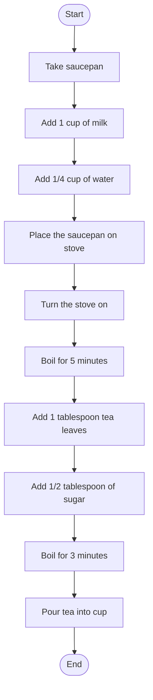

# Day 01 Practice — Computational Thinking

## Task 1
Decompose 'making a cup of tea' into a numbered list of steps, written for someone who has never made tea before

answer: 
1. Take a saucepan or a bowl
2. Add a cup of milk 
3. Add 1/4 cup of water
4. place the saucepan on the gas stove 
5. turn the gas stove on 
6. boil the mixture for 5 minutes
7. add 1 tablespoon of tea leaves
8. add 1/2 tablespoon of sugar
9. Boil for another 3 minutes
10. turn the stove off
11. take a cup
12. strain the tea into the cup
13. serve the tea 

## Task 2
Decompose one task from your own life (e.g. your tutoring prep routine) into clear steps

1. check the topic to teach
2. make relevant notes
3. make a practice file
4. make teaching slides
5. practice the topic myself
6. join the tutoring session
7. teach the topic
8. explain there doubts
9. give them homework
10. discuss there school work
11. ask if they need any help in school work

## Task 3
Draw a flowchart for the tea-making steps once we cover flowchart symbols

